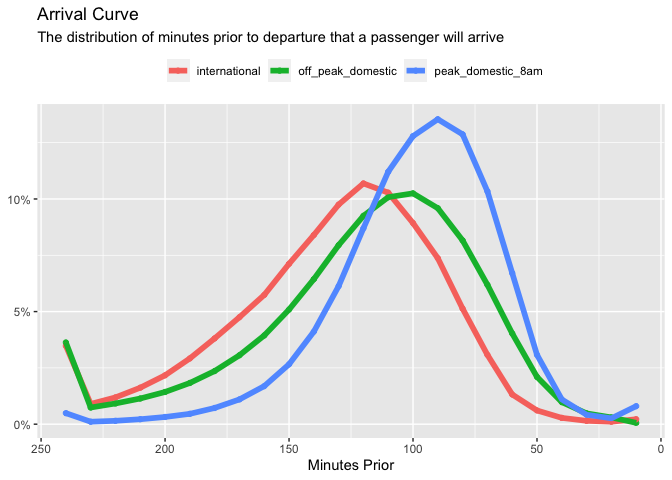

<!-- README.md is generated from README.Rmd. Please edit that file -->

# flightanalytics

<!-- badges: start -->
<!-- badges: end -->

The goal of {flightanalytics} is to provide a set of functions and
datasets to facilitate analyzing publich flight data.

## Installation

You can install the development version of flightanalytics from
[GitHub](https://github.com/) with:

    # install.packages("devtools")
    devtools::install_github("rplain1/flightanalytics")

## Example

``` r
library(flightanalytics)
library(ggplot2)
get_pgds_arrival_curve() |> 
  clean_arrival_curve() |> 
  ggplot(aes(minutes_prior, value, color = name)) +
  geom_point() +
  geom_line(linewidth = 2) +
  labs(
    title = 'Arrival Curve',
    subtitle = 'The distribution of minutes prior to departure that a passenger will arrive',
    x = 'Minutes Prior',
    y = NULL,
    color = NULL,
    fill = NULL,
  ) +
  scale_y_continuous(labels = scales::percent_format()) +
  scale_x_reverse() +
  theme(legend.position = 'top') 
```


